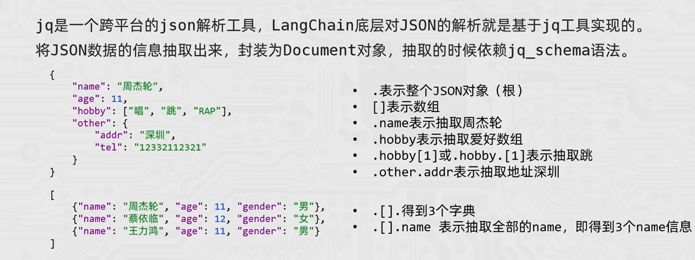

# Langchain

## 一、 简介

**LangChain** 是一个用于构建基于大语言模型 (LLM) 的应用框架，它可以方便地将 LLM 与外部数据源、工具、记忆系统结合，实现问答、对话、自动化脚本等功能。

**核心模块**:

- Models：LLM 模型、Chat 模型、嵌入模型
- Prompts：提示词模板、FewShot 示例
- Documents：文档加载器、文本分割器
- Vector Stores / Retrievers：向量存储和检索器，常用于 RAG
- Chains / LCEL：通过 Runnable 和 `|` 组织调用链
- Agents / LangGraph：智能体、工具调用和状态图编排

说明：LangChain v1 之后更强调 `Runnable`、LCEL 和 LangGraph；早期教程中常说的 Memory/Chains/Agents 仍有学习价值，但不要把它们理解成固定不变的六大模块。

## 二、安装部署

```
pip install langchain
pip install langchain-community         # 社区集成，支持大量第三方组件
pip install langchain-openai            # OpenAI 及兼容 OpenAI API 的模型
pip install langchain-ollama            # Ollama 本地模型
pip install langchain-qdrant            # Qdrant 向量库
```

## 三、核心模块

### 1. Model

Langchain支持三种模型，分别是LLMs、Chat Model、Embedding Model。

#### (1) LLMs

该类模型是**文本补全**模型
输入和输出都是**字符串**
参考示例如下：

```
from langchain_community.llms.tongyi import Tongyi
from dotenv import load_dotenv
import os

load_dotenv()

model = Tongyi(model = "qwen-max", api_key = os.getenv("LLM_API_KEY"))

# 调用invoke向模型提问
res = model.invoke(input="你是谁？")
print(type(res))                        # str
print(res)

# 调用 stream 方法向模型提问 - 流式输出
res = model.stream(input="什么是人工智能？")
for chunk in res:                       # type(res) : <class 'generator'>
    # print(type(chunk))                # str
    print(chunk, end="", flush=True)
```

#### (2) Chat Model

Chat Model 是目前 LangChain 中最常用的模型类型。
输入通常是 LangChain 的**消息类**，常用三类分别为 `SystemMessage`、`AIMessage` 和 `HumanMessage`，从 `langchain_core.messages` 中导入。也可以直接传入 OpenAI 风格的字典列表，LangChain 会自动转换。

**注**：如果采用 LangChain 框架中的特定三方封装（如 `langchain_community.chat_models.tongyi.ChatTongyi`），后期切换服务商时可能需要改导入和参数。对于兼容 OpenAI API 的服务，优先使用 `langchain_openai.ChatOpenAI` 会更容易迁移。

参考示例如下：采用**openai sdk**调用chat model

- 导入依赖

```
from langchain_openai import ChatOpenAI
from dotenv import load_dotenv
import os

from langchain_core.messages import SystemMessage, HumanMessage, AIMessage

load_dotenv()
```

- 创建客户端

```
model = ChatOpenAI(
    model = os.getenv("LLM_MODEL_ID"),
    api_key = os.getenv("LLM_API_KEY"),
    base_url = os.getenv("LLM_BASE_URL")
)

messages = [
    SystemMessage(content="你是我的人工智能助手，协助我解答问题。"),
    HumanMessage(content="请介绍一下自己。")
]
```

- 调用 invoke - 直接输出

```
# response = model.invoke(messages)
# print(type(response))               # <class 'langchain_core.messages.ai.AIMessage'>
# print(response.content)                     # 调用继承于BaseMessage的__str__方法，输出消息内容

# AIMessage → BaseMessage → Serializable → BaseModel
```

- 调用 stream - 流式输出

```
response_stream = model.stream(messages)
print(type(response_stream))        # <class 'generator'>
for chunk in response_stream:
    print(type(chunk))              # <class 'langchain_core.messages.ai.AIMessageChunk'>
    print(chunk.content,end="",flush=True)                     # 每次迭代输出一个消息块，直到流结束

# AIMessageChunk → AIMessage，BaseMessageChunk → BaseMessage → Serializable → BaseModel
```

**补充**：
对于messages可以采用如下方式进行简写：

```
messages = [
    SystemMessage(content="你是我的人工智能助手，协助我解答问题。"),
    HumanMessage(content="请介绍一下自己。")
]

# 简写
messages = [
    {"role": "system", "content": "你是我的人工智能助手，协助我解答问题。"},
    {"role": "user", "content": "请介绍一下自己。"}
]
```

#### (3) Embedding Model

Embedding Model 不负责聊天，它负责把文本变成向量。
下述例子调用阿里云的Embedding Model

```
# 导入依赖
from langchain_community.embeddings import DashScopeEmbeddings

# 定义模型
embed = DashScopeEmbeddings(
    model = os.getenv("EMBEDDING_MODEL_ID"), 
    dashscope_api_key = os.getenv("EMBEDDING_API_KEY"),
)

# 将字符串转换为向量 - embed_query() | embed_documents()
print(embed.embed_query("hello world")) # 单个字符串转换
print(embed.embed_documents(["hello world", "你好，世界"])) # 批量转换
```

### 2. Prompt

在 LangChain 中，Prompt 组件负责把你的输入变量组织成模型能理解的提示词。


```
# Langchain的Prompt组件
- 主要学习了三个类PromptTemplate、Chat Prompt Template和MessagesPlaceholder
- PromptTemplate 适合**文本补全模型**或者简单字符串提示词；ChatPromptTemplate适合聊天模型
- PromptTemplate采用from_template创建模板；ChatPromptTemplate采用from_messages创建模板
- PromptTemplate 和 ChatPromptTemplate 都具有两种常用模板注入方式：`invoke()` 和 `format()`。前者得到 PromptValue 系列对象（可用 `to_string()` 转成字符串），后者直接得到字符串。
- 在创建ChatPromptTemplate时，添加MessagesPlaceholder可以添加history变量，达到注入历史的功能。
```

#### (1) PromptTemplate：普通文本提示词模板

PromptTemplate 适合**文本补全模型**或者简单字符串提示词。

```
# 导入依赖
from langchain_core.prompts import PromptTemplate

# 创建模板 - 调用 **PromptTemplate.from_template()** 方法
prompt_template = PromptTemplate.from_template(
    "今天是{weekday}，心情不错。"
)

# 注入模板
# (1) 调用底层的invoke(), 输入是 "input={"插入键":"插入值",...}"
prompt = prompt_template.invoke(input={"weekday":"周五"})   
print(type(prompt))     # <class 'langchain_core.prompt_values.StringPromptValue'>
print(prompt)           # text='今天是周五，心情不错。'

# (2) 调用 format()
prompt = prompt_template.format(weekday="周五")   
print(type(prompt))     # <class 'str'>，直接返回字符串
print(prompt)           # 今天是周五，心情不错。

```

#### (2) ChatPromptTemplate

```
# 导入依赖
from langchain_core.prompts import ChatPromptTemplate

# 创建模板 - 调用ChatPromptTemplate.from_messages()
chat_prompt_template = ChatPromptTemplate.from_messages([
    ("system", "你是我的人工智能助手，协助我解答问题。"),
    ("user", "请介绍一下这个概念{concept}。")
])
print(type(chat_prompt_template))    # <class 'langchain_core.prompts.chat.ChatPromptTemplate'>

# 注入模板 - 调用底层的invoke()
prompt = chat_prompt_template.invoke(input={"concept": "Langchain"})
print(type(prompt))                  # <class 'langchain_core.prompts.chat.ChatPromptValue'>
print(prompt)

"""
    messages=[
    SystemMessage(content='你是我的人工智能助手，协助我解答问题。', additional_kwargs={}, response_metadata={}), 
    HumanMessage(content='请介绍一下这个概念Langchain。', additional_kwargs={}, response_metadata={})]
"""

# 如果想要直接输出字符串，调用to_string()方法
print(prompt.to_string())

"""
    System: 你是我的人工智能助手，协助我解答问题。
    Human: 请介绍一下这个概念Langchain。
"""
```

#### (3) MessagesPlaceholder

如果想要创建一个可以加入历史对话信息的ChatPromptTemplate，可以引入消息占位符MessagesPlaceholder。

```
# 导入依赖
from langchain_core.prompts import ChatPromptTemplate, MessagesPlaceholder

# 创建模板
chat_prompt_template = ChatPromptTemplate.from_messages([
    {"role": "system", "content": "你是我的人工智能助手，协助我解答问题。"},
    MessagesPlaceholder("history"),
    {"role": "user", "content": "{question}"}
])

# 示例历史信息
history = [
    {"role": "user", "content": "今天周几？"},
    {"role": "assistant", "content": "今天周五。"}      # 这里的角色也可以是"ai"
]

question = "明天周几？"


# 注入模板
prompt = chat_prompt_template.invoke(input={"history":history, "question":question})
print(type(prompt))         # # <class 'langchain_core.prompt_values.ChatPromptValue'>
print(prompt)

"""
    System: 你是我的人工智能助手，协助我解答问题。
    Human: 今天周几？
    AI: 今天周五。
    Human: 明天周几？
"""
```

### 3. Chain

对于Langchain中的大多组件，都是继承于**Runnable**类的子类。在**Runnable**类中重写了魔术方法"__or__()",可以将各组件通过"|"运算符连接起来，前一个组件的输出可以作为后者的输入。

- 前面提到的Model和Prompt组件也是**Runnable**类的子类，因此可以入链。
- 组件通过"|"得到的chain是RunnableSequence类，也是**Runnable**类的子类。

简单示例：

```
from dotenv import load_dotenv
import os
from langchain_openai import ChatOpenAI
from langchain_core.prompts import ChatPromptTemplate, MessagesPlaceholder

load_dotenv()

model = ChatOpenAI(
    model = os.getenv("LLM_MODEL_ID"),
    api_key = os.getenv("LLM_API_KEY"),
    base_url = os.getenv("LLM_BASE_URL")
)

chat_prompt_template = ChatPromptTemplate.from_messages([
    ("system", "你是我的人工智能助手，协助我解答问题。"),
    MessagesPlaceholder("history"),
    ("user", "{question}")
])

history = [
    {"role": "user", "content": "今天周几？"},
    {"role": "ai", "content": "今天周五。"}  
]


question = "明天周几？"

chain = chat_prompt_template | model
print(type(chain))                          # <class 'langchain_core.runnables.base.RunnableSequence'>

res = chain.stream(input={
    "history": history,
    "question": question
})

for chunk in res:
    if chunk.content:
        print(chunk.content, end="",flush=True)
```

#### (1) StrOutputParser

字符串输出解释器

- 将 Chat Model 输出的 `AIMessage` / `AIMessageChunk` 转换为普通字符串。
- 通过 `langchain_core.output_parsers import StrOutputParser`导入。

作用：

- 当想将model的输出传入给model再次调到时，会报错。
- 因为model的输出是一个AIMessage对象
- model的输入=只能是LanguageModelInput = PromptValue | str | Sequence[MessageLikeRepresentation]
  因此，当model组件相邻时，会发生报错。

```
chain = chat_prompt_template | model | model 
ValueError: Invalid input type <class 'langchain_core.messages.ai.AIMessageChunk'>. Must be a PromptValue, str, or list of BaseMessages.
```

通过采用 **StrOutputParser**（Runnable 子类）可以将 model 的输出转换为字符串，再传给下一个模型、提示词模板或普通函数。

```
from dotenv import load_dotenv
import os
from langchain_openai import ChatOpenAI
from langchain_core.prompts import ChatPromptTemplate, MessagesPlaceholder
from langchain_core.output_parsers import StrOutputParser

load_dotenv()

model = ChatOpenAI(
    model = os.getenv("LLM_MODEL_ID"),
    api_key = os.getenv("LLM_API_KEY"),
    base_url = os.getenv("LLM_BASE_URL")
)

chat_prompt_template = ChatPromptTemplate.from_messages([
    ("system", "You are a helpful assistant."),
    ("user", "{input}")
])

input = "春眠不觉晓的下一句是什么？"

chain = chat_prompt_template | model | StrOutputParser() | model
res = chain.invoke(input={"input": input})
print(res.content)
```

#### (2) JsonOutputParser

JSON 输出解释器

- 将 model 输出的 `AIMessage`（其中 `content` 是 JSON 字符串）转换为 Python 字典，可以继续注入到提示词模板中。
- 通过 `langchain_core.output_parsers import JsonOutputParser`导入。
- 相当于 `StrOutputParser()` 和 `json.loads()` 二者的结合。
- 前提是模型输出必须是合法 JSON；实践中最好在提示词里明确“只输出 JSON，不要 Markdown 代码块，不要解释”。

```
from dotenv import load_dotenv
import os
from langchain_openai import ChatOpenAI
from langchain_core.prompts import ChatPromptTemplate, MessagesPlaceholder
from langchain_core.output_parsers import JsonOutputParser

load_dotenv()

model = ChatOpenAI(
    model = os.getenv("LLM_MODEL_ID"),
    api_key = os.getenv("LLM_API_KEY"),
    base_url = os.getenv("LLM_BASE_URL")
)

first_prompt_template = ChatPromptTemplate.from_messages([
    ("system", "You are a helpful assistant."),
    ("user", "我的邻居姓:{lastname},刚生了{gender},请起名，并封装到JSON格式返回给我。要求key是name，value是名字，请严格遵守格式要求。")
])

second_prompt_template = ChatPromptTemplate.from_messages([
     ("user", "姓名{name},请帮我解析含义")
]) 


chain = first_prompt_template | model | JsonOutputParser() | second_prompt_template | model
res = chain.invoke(input={"lastname": "张", "gender": "男"})
print(res.content)
```

#### (3) RunnableLambda()

自定义函数组件

- 对一些自定义功能，可以通过 **RunnableLambda(function)** 转为一个 Runnable 对象加入链条。
- 在 LCEL 中也可以直接把普通函数放进链条，LangChain 通常会自动包装；显式使用 `RunnableLambda` 的好处是语义更清楚，也便于后续配置、复用和调试。
- 导入方法：`from langchain_core.runnables import RunnableLambda`

```
from dotenv import load_dotenv
import os
from langchain_openai import ChatOpenAI
from langchain_core.prompts import ChatPromptTemplate
from langchain_core.output_parsers import StrOutputParser
from langchain_core.runnables import RunnableLambda

load_dotenv()

model = ChatOpenAI(
    model = os.getenv("LLM_MODEL_ID"),
    api_key = os.getenv("LLM_API_KEY"),
    base_url = os.getenv("LLM_BASE_URL")
)

chat_prompt_template = ChatPromptTemplate.from_messages([
    ("system", "You are a helpful assistant."),
    ("user", "{input}")
])

input = "春眠不觉晓的下一句是什么？"

def print_prompt(prompt_value):
    print("========== 当前生成的提示词 ==========")
    print(prompt_value.to_string())
    print("======================================")
    return prompt_value


chain = chat_prompt_template | RunnableLambda(print_prompt) | model | StrOutputParser() 
res = chain.invoke(input={"input": input})
print(res)
```

#### (4) RunnablePassthrough

对于chain中数据有时候要流向不同的节点，或者需要在传递过程中保持某些参数原封不动，LangChain 提供了 `RunnablePassthrough`。

它主要有两个典型应用场景：
1. **直接透传数据**：把外部的输入原封不动地传递给下一步（常用于组装字典）。
2. **新增键值对 (`.assign()`)**：在原有的字典输入上，动态计算并附加新的变量。

这在 **RAG（检索增强生成）** 链路中组装 Prompt 参数时几乎是必用的组件。

- 导入方法：`from langchain_core.runnables import RunnablePassthrough`

**示例 1：直接透传 (将单点输入映射到字典的 value)**
```python
from langchain_core.runnables import RunnablePassthrough
from langchain_core.prompts import PromptTemplate

prompt = PromptTemplate.from_template("根据上下文：{context}，回答问题：{question}")

# 假设这里有一个 retriever
# retriever = ...

# RunnablePassthrough() 会把 invoke 时传入的原始字符串直接传递给 'question' 键
chain = {
    "context": lambda x: "这里是上下文内容", # 模拟检索器检索内容
    "question": RunnablePassthrough()       # 用户的字符串输入不作处理，直接透传
} | prompt

res = chain.invoke("Langchain是什么？")
print(res.text)
# 输出: 根据上下文：这里是上下文内容，回答问题：Langchain是什么？
```

**示例 2：使用 `.assign()` 动态新增字段**
如果输入已经是一个字典，你可以用 `assign` 给它附加新的键，而不破坏原来的内容。
```python
from langchain_core.runnables import RunnablePassthrough

def compute_length(params):
    return len(params["text"])

# 输入字典 {"text": "hello"}，在这里自动执行函数，给字典增加一个 "length" 字段
chain = RunnablePassthrough.assign(length=compute_length)

res = chain.invoke({"text": "hello"})
print(res)
# 输出: {'text': 'hello', 'length': 5}
```
### 4. Memory

LLM 本身是无状态的：每次调用只会看到本次请求中传入的消息。所谓“记忆”，本质上是应用程序把历史消息、摘要或外部检索结果重新放进当前上下文。

在 LangChain 中，常见记忆方式包括：

1. 会话历史：保存用户和 AI 的历史消息，并在下一轮调用时注入 Prompt。
2. 上下文裁剪：对历史消息做窗口截断或摘要，避免超过模型上下文长度。
3. 向量记忆 / RAG：把长期知识或历史片段写入向量库，按问题检索相关内容。
4. LangGraph State：在图编排中显式维护状态，适合复杂 Agent 流程。

#### (1) 会话历史

##### 1. 短期存储

对于会话历史，Langchain通过以下两个方法实现短期存储：

- RunnableWithMessageHistory：基于chain创建具备历史记忆功能的**新链**。
- InMemoryChatMessageHistory：在**内存**中按照会话id进行**临时**存储。

方法讲解：

```
# 导入依赖
from langchain_core.runnables.history import RunnableWithMessageHistory
from langchain_core.chat_history import InMemoryChatMessageHistory

# InMemoryChatMessageHistory
store[session_id] = InMemoryChatMessageHistory()     # 直接赋值给一个session_id即可

# RunnableWithMessageHistory
conversation_chain = RunnableWithMessageHistory(
    base_chain,                                 # 基础链
    get_session_history,    #根据sessionid(通过config参数)内存历史的函数，需自定义                  
    input_messages_key = "input",               # 表示用户输入在模板中的占位符
    history_messages_key = "chat_history"       # 表示历史消息在模板中的占位符
)
```

具体例子：

```
from dotenv import load_dotenv
import os
from langchain_openai import ChatOpenAI
from langchain_core.prompts import ChatPromptTemplate,MessagesPlaceholder
from langchain_core.runnables.history import RunnableWithMessageHistory
from langchain_core.chat_history import InMemoryChatMessageHistory

load_dotenv()

model = ChatOpenAI(
    model = os.getenv("LLM_MODEL_ID"),  
    api_key = os.getenv("LLM_API_KEY"),
    base_url = os.getenv("LLM_BASE_URL")
)

# 记忆内存存储
store = {}
def get_session_history(session_id):
    if session_id not in store:
        store[session_id] = InMemoryChatMessageHistory()
    return store[session_id]

chat_prompt_template = ChatPromptTemplate.from_messages([
    ("system", "You are a helpful assistant."), 
    MessagesPlaceholder(variable_name="history"),  
    ("user", "{input}")
])

question = [
    "春眠不觉晓的下一句是什么？",
    "夜来风雨声的下一句是什么？",
]

def print_prompt(prompt_value):
    print("========== 当前生成的提示词 ==========")
    print(prompt_value.to_string())
    print("======================================")
    return prompt_value

chain = chat_prompt_template | print_prompt | model

conversation_chain = RunnableWithMessageHistory(
    chain, 
    get_session_history,
    input_messages_key="input",
    history_messages_key="history",
)

config = {"configurable": {"session_id": "test_session"}}

for count, q in enumerate(question):
    res = conversation_chain.invoke(input={"input": q}, config=config)
    print(f"========== 第 {count + 1} 个问题的模型回复 ==========")
    print(res.content)
    print("======================================")
```

##### 2. 长期存储

- 长期存储 = 把对话历史持久化到文件 / 数据库 / Redis/MySQL 等，重启不丢失。
- 本质：自定义一个符合 LangChain 规范的「消息历史存储类」，替代内存版 InMemoryChatMessageHistory。

**存储架构**

```
会话ID → 唯一标识一个用户对话
存储介质（文件/MySQL/Redis）→ 保存 messages 列表
自定义类 → 实现 add / get / clear
RunnableWithMessageHistory → 接入链，自动读写历史
```

**任何存储（文件 / MySQL/Redis）都必须实现以下三个方法**

```
# 必须继承 BaseChatMessageHistory
from langchain_core.chat_history import BaseChatMessageHistory

class XXXChatMessageHistory:
    # 1. 获取所有历史消息（返回 List[BaseMessage]）
    @property
    def messages(self):
        pass

    # 2. 添加单条用户/AI消息
    def add_message(self, message):
        pass

    # 3. 清空当前会话历史
    def clear(self):
        pass
```

以下例子介绍如果将BaseMessage对象 → 字典 → json字符串存入文件中进行长期存储。

```
from dotenv import load_dotenv
import os
from typing import List
import json

from langchain_openai import ChatOpenAI
from langchain_core.prompts import ChatPromptTemplate,MessagesPlaceholder
from langchain_core.runnables.history import RunnableWithMessageHistory
from langchain_core.chat_history import BaseChatMessageHistory  # 需要继承的基类
from langchain_core.messages import BaseMessage, message_to_dict, messages_from_dict

class FileChatMessageHistory(BaseChatMessageHistory):
    """基于文件存储的聊天记录"""
    def __init__(self, session_id:str, storage_path:str):
        self.session_id = session_id
        self.storage_path = storage_path
        self.file_path = os.path.join(storage_path, f"{session_id}.json")

    @property
    def messages(self) -> List[BaseMessage]:
        if not os.path.exists(self.file_path):
            return []
        with open(self.file_path, "r", encoding="utf-8") as f:
            messages_dict = json.load(f)
        return messages_from_dict(messages_dict)

    def add_message(self, message):
        messages = self.messages
        messages.append(message)
        messages_dict = [message_to_dict(m) for m in messages]
        with open(self.file_path, "w", encoding="utf-8") as f:
            json.dump(messages_dict, f, ensure_ascii=False, indent=4)   # indent代表缩进格式化输出

    def clear(self):
        if os.path.exists(self.file_path):
            os.remove(self.file_path)


load_dotenv()

model = ChatOpenAI(
    model = os.getenv("LLM_MODEL_ID"),
    api_key = os.getenv("LLM_API_KEY"),
    base_url = os.getenv("LLM_BASE_URL")
)

def get_session_history(session_id):
    current_dir = os.path.dirname(__file__)
    storage_path = os.path.join(current_dir, "chat_history")
    if not os.path.exists(storage_path):
        os.makedirs(storage_path)
    return FileChatMessageHistory(session_id, storage_path)

chat_prompt_template = ChatPromptTemplate.from_messages([
    ("system", "You are a helpful assistant."), 
    MessagesPlaceholder(variable_name="history"),  
    ("user", "{input}")
])

question = [
    "春眠不觉晓的下一句是什么？",
    "夜来风雨声的下一句是什么？",
]

def print_prompt(prompt_value):
    print("========== 当前生成的提示词 ==========")
    print(prompt_value.to_string())
    print("======================================")
    return prompt_value

chain = chat_prompt_template | print_prompt | model

conversation_chain = RunnableWithMessageHistory(
    chain,
    get_session_history,
    input_messages_key="input",
    history_messages_key="history",
)

config = {"configurable": {"session_id": "user01_001"}}

for count, q in enumerate(question):
    res = conversation_chain.invoke(input={"input": q}, config=config)
    print(f"========== 第 {count + 1} 个问题的模型回复 ==========")
    print(res.content)
    print("======================================")
```

#### (2) 上下文裁剪

会话历史不能无限塞进 Prompt，因为模型有上下文窗口限制，并且历史越长成本越高、噪声越多。常见处理方式：

- 最近窗口：只保留最近 N 轮对话。
- 摘要记忆：把较早的对话压缩成摘要，再和最近几轮一起传入模型。
- 按相关性检索：把历史片段向量化，当前问题只检索相关片段。

简单窗口裁剪示例：

```python
def trim_history(messages, max_messages=6):
    return messages[-max_messages:]
```

生产场景通常会按 token 数裁剪，而不只是按消息条数裁剪。

#### (3) LangGraph State

LangGraph 更适合多步骤 Agent 或复杂工作流。它把“记忆”显式放在 State 中：每个节点读取 State、更新 State，再交给下一个节点。这样比隐式 Memory 更容易调试和恢复。

可以先记住一句话：普通聊天历史用 `RunnableWithMessageHistory` 就够了；如果流程里有多个节点、工具调用、循环和条件分支，再考虑 LangGraph State。

### 5. Document Loaders组件

本质：通过DocumentLoader将各种格式的文件(如PDF、word、Markdown等)转换为**Document对象**。

1. 创建Document对象的方法以及Document对象的主要属性。

```
from langchain_core.documents import Document

doc = Document(
    page_content="Hello, world!",
    metadata={"source": "web", "page": 1},
    id="doc-123"
)
```

2. Document Loaders的**核心方法**

- load(): **一次性**加载所有文档
- lazy_load(): 延迟流式传输文档，对大型数据集很有用，**避免内存溢出**。
- aload(): **异步**加载

#### (1) CSVLoader

```
from langchain_community.document_loaders import CSVLoader
import os

current_dir = os.path.dirname(os.path.abspath(__file__))

loader = CSVLoader(
    file_path = os.path.join(current_dir, "data/csv_loader.csv"),
    encoding="utf-8",           # CSV文件的编码格式，默认为utf-8 
    csv_args={
        "delimiter": ",",       # CSV文件的分隔符，默认为逗号
        "quotechar": '"',      # CSV文件中用于引用字段的字符，默认为双引号
        # "fieldnames": ["name", "age", "gender"],  # CSV 缺失表头时可以手动指定字段名。
    }
)

documents = loader.load()   # documents: List[Document]
for doc in documents:
    print(doc)


documents = loader.lazy_load()   # documents: Iterable[Document]
for doc in documents:
    print(doc)
```

#### (2) JsonLoader



以下是基本的示例

```
# 导入依赖
from langchain_community.document_loaders import JSONLoader
import os,json

current_dir = os.path.dirname(os.path.abspath(__file__))

loader = JSONLoader(
    # 必要参数
    file_path=os.path.join(current_dir, "data/json_loader_json.json"),
    jq_schema= ".",         # 选择整个 JSON 文件作为一个文档
    # 可选参数
    text_content=False,     # 指明抽取部分是不是str类型，默认为True，如果抽取部分不是str类型，设置为False, 会自动将抽取部分转换为str类型，再传入Document的page_content中
    json_lines = False      # JSON 文件是否为 JSON Lines 格式
)

docs = loader.load()
for doc in docs:
    # page_content 的保存类型是字符串；如果直接打印，中文可能会以 Unicode 转义形式显示。
    # print(type(doc.page_content))
    # print(doc.page_content)

    # 先将包含unicode编码的字符串转换回Python对象（如字典），再使用json.dumps()将其转换为格式化的JSON字符串，这样就可以正确显示中文了。
    doc_content_dict = json.loads(doc.page_content)
    json_obj = json.dumps(doc_content_dict, ensure_ascii=False, indent=4)
    print(type(json_obj))
    print(json_obj)
```

#### (3) PDFLoader
参考示例
```
from langchain_community.document_loaders import PyPDFLoader
import os

current_dir = os.path.dirname(os.path.abspath(__file__))

loader = PyPDFLoader(
    file_path=os.path.join(current_dir, "data/智能汽车创新发展战略.pdf"),
    mode='page',          # 读取模式：'page': 将每一页作为一个Document对象; 'single': 将整个PDF作为一个Document对象
    password=None,        # PDF文件的密码，如果有的话
)

docs = loader.load()
for count, doc in enumerate(docs):
    print(f"Document {count + 1}: {doc.page_content}")
```
#### (4) TextLoader和文档分割器

- TextLoader：把纯文本文件加载为 Document。
-  RecursiveCharacterTextSplitter:递归字符文本分割器


具体使用用法见下面的示例，值得注意的是，进行分块后的chunk依然是**Document**对象。
```
# 导入依赖
from langchain_community.document_loaders import TextLoader
from langchain_text_splitters import RecursiveCharacterTextSplitter
import os

current_dir = os.path.dirname(os.path.abspath(__file__))

loader = TextLoader(
    os.path.join(current_dir, "data/text_loader.txt"), 
    encoding="utf-8"
)

docs = loader.load()

print(len(docs))  # 输出加载的文档数量

# 定义文本分割器
txt_splitter = RecursiveCharacterTextSplitter(
    chunk_size=500,         # 每个文本块的最大长度 
    chunk_overlap=50,       # 文本块之间的重叠长度
    separators=["\n\n", "\n", " ", ""],     # 分割文本的的符号以及优先级顺序
    length_function=len,    # 计算文本长度的函数
)

split_docs = txt_splitter.split_documents(docs)
print(len(split_docs))  # 输出分割后的文本块数量

for i, doc in enumerate(split_docs):
    print(f"========== 文本块 {i + 1} ==========")
    print(type(doc))    # 输出文本块内容的类型
    print(doc.page_content)
    print("======================================")
```


### 6. Vector Store
采用**Qdrant**进行向量存储。


#### (1) Qdrant

Qdrant 的相关概念：
- size: 向量的维度
- distance: 计算相似度/距离采用的函数，常见有 COSINE、DOT、EUCLID
- collection: 类似数据库的表。  

每个点的数据结构及各参数作用如下：
Point = 
  1. id (唯一标识) 
  2. vector (向量，必须是数字数组，维度必须与 collection 的 size 一致)
  3. payload (**元数据**，JSON 格式，用于筛选，可选)

以下是qdrant的**原生**操作
```
from dotenv import load_dotenv
import os

from qdrant_client import QdrantClient

load_dotenv()

# 1. 定义客户端
client = QdrantClient(
    host = os.getenv("QDRANT_HOST"),
    port = os.getenv("QDRANT_PORT")
)

print(client.get_collections())


# 2. 创建一个新的 collection
from qdrant_client.models import Distance, VectorParams

collection_name = os.getenv("QDRANT_COLLECTION") # 从 QDRANT_COLLECTION 获取
vector_size = int(os.getenv("QDRANT_VECTOR_SIZE"))

# 如果集合不存在则创建
if not client.collection_exists(collection_name):
    client.create_collection(
        collection_name=collection_name,
        vectors_config=VectorParams(
            size=vector_size,               
            distance=Distance.COSINE
        )
    )

print(client.get_collections())

# 3. 插入向量

from qdrant_client.models import PointStruct

# 补齐维度以匹配设置的 384 维度
test_vector = [0.1, 0.2, 0.3, 0.4] + [0.0] * (vector_size - 4)

client.upsert(
    collection_name=collection_name,
    points=[                            # List[PointStruct]
        PointStruct(
            id=1,
            vector=test_vector,
            payload={
                "text": "JWT 是 Token 格式",
                "category": "backend"
            }
        ),
        PointStruct(
            id=2,
            vector=test_vector,
            payload={
                "text": "text2",
                "category": "backend"
            }
        ),
        PointStruct(
            id=3,
            vector=[0.15]*vector_size,
            payload={
                "text": "text3",
                "category": "frontend"
            }
        )
    ]
)

print("插入成功")


# 5. 查询向量
query_vector = [0.15]*vector_size  # 查询向量，维度与插入的向量相同

# 搜索 top-2 最相似
search_result = client.query_points(
    collection_name=collection_name,
    query=query_vector,
    limit=2
)

print(type(search_result))          # <class 'qdrant_client.http.models.models.QueryResponse'>

# 打印结果
for hit in search_result.points:
    print(f"ID: {hit.id}, 得分: {hit.score:.4f}, 内容: {hit.payload}")


# 先结构化过滤再查询
from qdrant_client.models import Filter, FieldCondition, MatchValue

# 只搜 category = "backend" 的结果
search_result = client.query_points(
    collection_name=collection_name,
    query=query_vector,
    query_filter=Filter(
        must=[
            FieldCondition(
                key="category",
                match=MatchValue(value="backend")
            )
        ]
    ),
    limit=2
)

print("结构化过滤后查询结果：")
for hit in search_result.points:
    print(f"ID: {hit.id}, 得分: {hit.score:.4f}, 内容: {hit.payload}")
```

#### (2) VectorStore
VectorStore是Langchain中向量存储的基类，所有继承VectorStore类要求实现以下接口
```
add_documents()
delete()
similarity_search()
as_retriever()  # 将VectorStore对象转为一个Retriever对象，可以直接入链。
```
简单示例：
```
from dotenv import load_dotenv
import os 

from langchain_community.embeddings import DashScopeEmbeddings
from qdrant_client import QdrantClient
from langchain_qdrant import QdrantVectorStore
from qdrant_client.models import VectorParams, Distance


load_dotenv()

embed = DashScopeEmbeddings(
    model = os.getenv("EMBEDDING_MODEL_ID"), 
    dashscope_api_key = os.getenv("EMBEDDING_API_KEY"),
)

client = QdrantClient(
    host = os.getenv("QDRANT_HOST"),
    port = os.getenv("QDRANT_PORT")
)

# 初始化一个空的 QdrantVectorStore
collection_name = "test_collection"

if not client.collection_exists(collection_name):
    print(f"集合 {collection_name} 不存在，正在创建...")
    client.create_collection(
        collection_name=collection_name,
        vectors_config=VectorParams(size=1536, distance=Distance.COSINE) # 向量维度必须与实际 embedding 模型输出维度一致
    )

vector_store = QdrantVectorStore(
    client=client,
    collection_name=collection_name,
    embedding=embed
)

print(f"Vector Store 初始化成功: {vector_store}")

# ========================================
# 插入向量

from langchain_core.documents import Document

docs = [
    Document(page_content="Qdrant 是高性能向量数据库", metadata={"source": "wiki"}),
    Document(page_content="LangChain 是 LLM 应用框架", metadata={"source": "docs"})
]

# 写入 Qdrant（自动生成向量 → 变成 Point 存入）
vector_store.add_documents(docs)


# ========================================
# 查询向量

results = vector_store.similarity_search("向量数据库", k=1)     # list[Document]

for doc in results:
    print(doc.page_content)
    print(doc.metadata)

# ========================================
# 结构化过滤查询
# 只查 source=wiki 的文档
from qdrant_client.models import Filter, FieldCondition, MatchValue

results = vector_store.similarity_search(
    "向量数据库",
    k=1,
    filter=Filter(
        must=[
            FieldCondition(
                key="metadata.source", # QdrantVectorStore 默认会把 Document.metadata 嵌套存在 payload 的 "metadata" 键下
                match=MatchValue(value="wiki")
            )
        ]
    )
)
print("结构化过滤后查询结果：")
for doc in results:
    print(doc.page_content)
    print(doc.metadata)
```

### 7. Retriever 与 RAG

RAG（Retrieval-Augmented Generation，检索增强生成）是 LangChain 中最常见的应用链路。它的核心思想是：不要只依赖模型参数里的知识，而是在回答前先从外部知识库检索相关内容，再把检索结果作为上下文交给模型。

完整流程：

```
原始文档 → DocumentLoader → TextSplitter → Embedding → VectorStore → Retriever → Prompt → ChatModel → OutputParser
```

#### (1) Retriever

`Retriever` 是检索器，输入通常是用户问题，输出是相关的 `Document` 列表。VectorStore 可以通过 `as_retriever()` 转成 Retriever。

`similarity_search()` 和 `as_retriever()` 的区别：

- `similarity_search("问题", k=3)`：立即执行一次相似度搜索，返回 `list[Document]`。
- `as_retriever(search_kwargs={"k": 3})`：把 VectorStore 包装成 Runnable 风格的检索器，可以放进 chain。

```python
retriever = vector_store.as_retriever(search_kwargs={"k": 3})
docs = retriever.invoke("LangChain 是什么？")
```

#### (2) 格式化检索结果

Retriever 返回的是 `Document` 列表，Prompt 通常需要字符串，所以要先格式化：

```python
def format_docs(docs):
    return "\n\n".join(doc.page_content for doc in docs)
```

#### (3) RAG Chain

典型 RAG 链路如下：

```python
from langchain_core.runnables import RunnablePassthrough
from langchain_core.output_parsers import StrOutputParser

rag_chain = {
    "context": retriever | format_docs,
    "question": RunnablePassthrough(),
} | prompt | model | StrOutputParser()

answer = rag_chain.invoke("向量数据库有什么作用？")
print(answer)
```

这里的字典写法本质上是在并行构造 Prompt 需要的输入字段：

- `context`：由用户问题进入 retriever，检索文档，再格式化成字符串。
- `question`：通过 `RunnablePassthrough()` 原样保留用户问题。

#### (4) 带来源的 RAG

实际应用中，最好把答案和来源文档一起返回，方便检查模型是否胡编。

```python
rag_chain_with_source = RunnablePassthrough.assign(
    context=lambda x: format_docs(retriever.invoke(x["question"]))
) | {
    "answer": prompt | model | StrOutputParser(),
    "sources": lambda x: x["context"],
}
```

更清晰的写法是：先手动检索 `docs`，再把 `docs` 和答案一起打印。学习阶段推荐先用这种方式，容易理解数据流。

### 8. 结构化输出

结构化输出是指让模型返回可被程序稳定解析的数据，而不是自然语言段落。常见方式有两种：

#### (1) JsonOutputParser

适合学习和简单场景。缺点是模型可能返回非法 JSON，所以要在提示词中严格要求格式。

```python
chain = prompt | model | JsonOutputParser()
result = chain.invoke({"text": "苹果公司发布了新财报。"})
print(type(result))  # dict
```

#### (2) with_structured_output

更推荐用于严肃业务：先用 Pydantic 定义 schema，再让模型按 schema 输出。

```python
from pydantic import BaseModel, Field

class Event(BaseModel):
    company: str = Field(description="公司名称")
    event_type: str = Field(description="事件类型，如融资、并购、财报、其他")
    amount: str | None = Field(description="金额，无法确定则为 None")

structured_model = model.with_structured_output(Event)
result = structured_model.invoke("苹果公司发布了新财报。")
print(result.company)
```

选择建议：

- 只想把 JSON 字符串转成字典：用 `JsonOutputParser`。
- 希望字段、类型、描述更明确：用 `with_structured_output()`。
- 如果模型或兼容 API 不支持工具/结构化输出，`with_structured_output()` 可能不可用，这时退回 `JsonOutputParser`。

### 9. Tools 与工具调用

Tool 是把普通 Python 函数包装成模型可理解、可调用的工具。Agent 的基础就是“模型决定是否调用工具，以及调用哪个工具”。

#### (1) 定义工具

```python
from langchain_core.tools import tool

@tool
def add(a: int, b: int) -> int:
    """计算两个整数的和。"""
    return a + b
```

工具需要清晰的函数名、参数类型和 docstring，因为这些会变成模型判断是否调用工具的重要信息。

#### (2) 绑定工具到模型

```python
model_with_tools = model.bind_tools([add])
response = model_with_tools.invoke("请计算 12 + 30")
print(response.tool_calls)
```

此时模型通常不会直接执行 Python 函数，而是返回一个 tool call，告诉程序“我想调用哪个工具、参数是什么”。程序执行工具后，再把工具结果交回模型生成最终回答。

#### (3) 学习顺序

建议先掌握：

1. `@tool` 如何包装函数。
2. `model.bind_tools()` 如何让模型生成 tool call。
3. 程序如何执行 tool call。
4. 再学习 Agent 自动循环。

### 10. LCEL 进阶

LCEL（LangChain Expression Language）是用 `Runnable` 组织链路的表达式风格。前面已经用了 `|`，还需要掌握几个常用能力。

#### (1) invoke / stream / batch

```python
chain.invoke({"input": "你好"})      # 单次调用
chain.stream({"input": "你好"})      # 流式调用
chain.batch([                       # 批量调用
    {"input": "问题1"},
    {"input": "问题2"},
])
```

#### (2) RunnableParallel

当你希望同一个输入同时生成多个字段，可以使用字典写法或 `RunnableParallel`。

```python
from langchain_core.runnables import RunnableParallel, RunnablePassthrough

parallel = RunnableParallel({
    "origin": RunnablePassthrough(),
    "length": lambda x: len(x),
})

print(parallel.invoke("LangChain"))
```

#### (3) assign

`RunnablePassthrough.assign()` 用于在保留原始字典输入的基础上新增字段。

```python
chain = RunnablePassthrough.assign(length=lambda x: len(x["text"]))
print(chain.invoke({"text": "hello"}))
```

#### (4) with_config

`with_config()` 可以为链路加上标签、元数据、运行名，便于日志和 LangSmith 追踪。

```python
chain = chain.with_config({
    "run_name": "basic_qa_chain",
    "tags": ["demo", "qa"],
})
```

#### (5) with_retry

`with_retry()` 可以给 Runnable 增加失败重试，适合网络波动或模型接口偶发失败的场景。

```python
chain = chain.with_retry(stop_after_attempt=3)
```

### 11. Agent 入门

Agent = 模型 + 工具 + 决策循环。

普通 Chain 的流程是固定的：Prompt → Model → Parser。Agent 的流程不是完全固定的，模型会根据问题判断是否需要调用工具、调用哪个工具、拿到工具结果后是否继续推理。

最小理解：

```
用户问题 → 模型判断是否需要工具 → 调用工具 → 工具结果返回模型 → 模型生成最终答案
```

LangChain v1 中可以用 `create_agent` 快速创建 Agent；复杂流程建议学习 LangGraph，因为 LangGraph 能显式表达节点、边、状态和循环。

学习建议：

1. 先会写 Tool。
2. 再理解 tool call 的请求和执行。
3. 再使用 Agent 封装自动循环。
4. 最后再学 LangGraph 处理复杂状态流。
