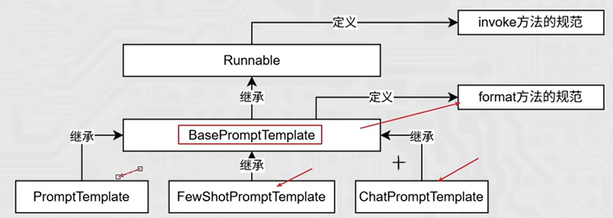

# Langchain

## 一、 简介

**LangChain** 是一个用于构建基于大语言模型 (LLM) 的应用框架，它可以方便地将 LLM 与外部数据源、工具、记忆系统结合，实现问答、对话、自动化脚本等功能。

**核心架构六大组件**:

- Models：LLM 模型、Chat 模型、嵌入模型
- Prompts：提示词模板、FewShot 示例
- Documents：文档加载器、文本分割器
- Memory：会话记忆、向量记忆、实体记忆
- Chains：任务链路编排（问答链、摘要链、路由链）
- Agents：智能体 + 工具调用，自主决策执行任务

## 二、安装部署

```
pip install langchain
pip install langchain-community         # 社区版，支持第三方模型调用
pip install langchain-ollama            # 支持调用ollama本地部署的llm
```

## 三、核心模块

### 1. Model

Langchain支持三种模型，分别是LLMs、Chat Model、Embedding Model。

#### (1) LLMs

该类模型是**文本补全**模型
输入和输出都是**字符串**
参考示例如下：

```
from langchain_community.llms.tongyi import Tongyi
from dotenv import load_dotenv
import os

load_dotenv()

model = Tongyi(model = "qwen-max", api_key = os.getenv("LLM_API_KEY"))

# 调用invoke向模型提问
res = model.invoke(input="你是谁？")
print(type(res))                        # str
print(res)

# 调用 stream 方法向模型提问 - 流式输出
res = model.stream(input="什么是人工智能？")
for chunk in res:                       # type(res) : <class 'generator'>
    # print(type(chunk))                # str
    print(chunk, end="", flush=True)
```

#### (2) Chat Model

Chat Model 是目前 LangChain 中最常用的模型类型。
输入是Langchain的**消息类**，一共有三类分别为 `SystemMessage`、`AIMessage`和 `HumanMessage`。从 ` langchain_core.messages`中导入消息类。

**注**：如果采用Langchain框架中三方sdk如 `langchain_community.chat_models.tongyi.ChatTongyi`,后期切换api不便，所以采用大多三方api兼容的openai sdk。

参考示例如下：采用**openai sdk**调用chat model

- 导入依赖

```
from langchain_openai import ChatOpenAI
from dotenv import load_dotenv
import os

from langchain_core.messages import SystemMessage, HumanMessage, AIMessage

load_dotenv()
```

- 创建客户端

```
model = ChatOpenAI(
    model = os.getenv("LLM_MODEL_ID"),
    api_key = os.getenv("LLM_API_KEY"),
    base_url = os.getenv("LLM_BASE_URL")
)

messages = [
    SystemMessage(content="你是我的人工智能助手，协助我解答问题。"),
    HumanMessage(content="请介绍一下自己。")
]
```

- 调用 invoke - 直接输出

```
# response = model.invoke(messages)
# print(type(response))               # <class 'langchain_core.messages.ai.AIMessage'>
# print(response.content)                     # 调用继承于BaseMessage的__str__方法，输出消息内容

# AIMessage → BaseMessage → Serializable → BaseModel
```

- 调用 stream - 流式输出

```
response_stream = model.stream(messages)
print(type(response_stream))        # <class 'generator'>
for chunk in response_stream:
    print(type(chunk))              # <class 'langchain_core.messages.ai.AIMessageChunk'>
    print(chunk.content,end="",flush=True)                     # 每次迭代输出一个消息块，直到流结束

# AIMessageChunk → AIMessage，BaseMessageChunk → BaseMessage → Serializable → BaseModel
```

**补充**：
对于messages可以采用如下方式进行简写：

```
messages = [
    SystemMessage(content="你是我的人工智能助手，协助我解答问题。"),
    HumanMessage(content="请介绍一下自己。")
]

# 简写
messages = [
    {"role": "system", "content": "你是我的人工智能助手，协助我解答问题。"},
    {"role": "user", "content": "请介绍一下自己。"}
]
```

#### (3) Embedding Model

Embedding Model 不负责聊天，它负责把文本变成向量。
下述例子调用阿里云的Embedding Model

```
# 导入依赖
from langchain_commnity.embeddings import DashScopeEmbeddings

# 定义模型
embed = DashScopeEmbeddings(
    model = os.getenv("EMBEDDING_MODEL_ID"), 
    dashscope_api_key = os.getenv("EMBEDDING_API_KEY"),
)

# 将字符串转换为向量 - embed_query() | embed_documents()
print(embed.embed_query("hello world")) # 单个字符串转换
print(embed.embed_documents(["hello world", "你好，世界"])) # 批量转换
```

### 2. Prompt

在 LangChain 中，Prompt 组件负责把你的输入变量组织成模型能理解的提示词。


```
# Langchain的Prompt组件
- 主要学习了三个类PromptTemplate、Chat Prompt Template和MessagesPlaceholder
- PromptTemplate 适合**文本补全模型**或者简单字符串提示词；ChatPromptTemplate适合聊天模型
- PromptTemplate采用from_template创建模板；ChatPromptTemplate采用from_messages创建模板
- PromptTemplate和Chat Prompt Template都具有两种模板注入方式：invoke()和format()。前者得到的是PromptValue系列的对象（采用to_string()得到字符串），后者直接得到字符串。
- 在创建ChatPromptTemplate时，添加MessagesPlaceholder可以添加history变量，达到注入历史的功能。
```

#### (1) PromptTemplate：普通文本提示词模板

PromptTemplate 适合**文本补全模型**或者简单字符串提示词。

```
# 导入依赖
from langchain_core.prompts import PromptTemplate

# 创建模板 - 调用 **PromptTemplate.from_template()** 方法
prompt_template = PromptTemplate.from_template(
    "今天是{weekday}，心情不错。"
)

# 注入模板
# (1) 调用底层的invoke(), 输入是 "input={"插入键":"插入值",...}"
prompt = prompt_template.invoke(input={"weekday":"周五"})   
print(type(prompt))     # <class 'langchain_core.prompt_values.StringPromptValue'>
print(prompt)           # text='今天是周五，心情不错。'

# (2) 调用fromat() 
prompt = prompt_template.format(weekday="周五")       
print(type(prompt))     # <class 'str'>，直接返回字符串
print(prompt)           # 今天是周五，心情不错。

```

#### (2) ChatPromptTemplate

```
# 导入依赖
from langchain_core.prompts import ChatPromptTemplate

# 创建模板 - 调用ChatPromptTemplate.from_messages()
chat_prompt_template = ChatPromptTemplate.from_messages([
    ("system", "你是我的人工智能助手，协助我解答问题。"),
    ("user", "请介绍一下这个概念{concept}。")
])
print(type(chat_prompt_template))    # <class 'langchain_core.prompts.chat.ChatPromptTemplate'>

# 注入模板 - 调用底层的invoke()
prompt = chat_prompt_template.invoke(input={"concept": "Langchain"})
print(type(prompt))                  # <class 'langchain_core.prompts.chat.ChatPromptValue'>
print(prompt)

"""
    messages=[
    SystemMessage(content='你是我的人工智能助手，协助我解答问题。', additional_kwargs={}, response_metadata={}), 
    HumanMessage(content='请介绍一下这个概念Langchain。', additional_kwargs={}, response_metadata={})]
"""

# 如果想要直接输出字符串，调用to_string()方法
print(prompt.to_string())

"""
    System: 你是我的人工智能助手，协助我解答问题。
    Human: 请介绍一下这个概念Langchain。
"""
```

#### (3) MessagesPlaceholder

如果想要创建一个可以加入历史对话信息的ChatPromptTemplate，可以引入消息占位符MessagesPlaceholder。

```
# 导入依赖
from langchain_core.prompts import ChatPromptTemplate, MessagesPlaceholder

# 创建模板
chat_prompt_template = ChatPromptTemplate.from_messages([
    {"role": "system", "content": "你是我的人工智能助手，协助我解答问题。"},
    MessagesPlaceholder("history"),
    {"role": "user", "content": "{question}"}
])

# 示例历史信息
history = [
    {"role": "user", "content": "今天周几？"}，
    {"role": "assistant", "content": "今天周五。"}      # 这里的角色也可以是"ai"
]

question = "明天周几？"


# 注入模板
prompt = chat_prompt_template.invoke(input={"history":history, "question":question})
print(type(prompt))         # # <class 'langchain_core.prompt_values.ChatPromptValue'>
print(prompt)

"""
    System: 你是我的人工智能助手，协助我解答问题。
    Human: 今天周几？
    AI: 今天周五。
    Human: 明天周几？
"""
```

### 3. Chain

对于Langchain中的大多组件，都是继承于**Runnable**类的子类。在**Runnable**类中重写了魔术方法"__or__()",可以将各组件通过"|"运算符连接起来，前一个组件的输出可以作为后者的输入。

- 前面提到的Model和Prompt组件也是**Runnable**类的子类，因此可以入链。
- 组件通过"|"得到的chain是RunnableSequence类，也是**Runnable**类的子类。

简单示例：

```
from dotenv import load_dotenv
import os
from langchain_openai import ChatOpenAI
from langchain_core.prompts import ChatPromptTemplate, MessagesPlaceholder

load_dotenv()

model = ChatOpenAI(
    model = os.getenv("LLM_MODEL_ID"),
    api_key = os.getenv("LLM_API_KEY"),
    base_url = os.getenv("LLM_BASE_URL")
)

chat_prompt_template = ChatPromptTemplate.from_messages([
    ("system", "你是我的人工智能助手，协助我解答问题。"),
    MessagesPlaceholder("history"),
    ("user", "{question}")
])

history = [
    {"role": "user", "content": "今天周几？"},
    {"role": "ai", "content": "今天周五。"}      
]


question = "明天周几？"

chain = chat_prompt_template | model
print(type(chain))                          # <class 'langchain_core.runnables.base.RunnableSequence'>

res = chain.stream(input={
    "history": history,
    "question": question
})

for chunk in res:
    if chunk.content:
        print(chunk.content, end="",flush=True)
```

#### (1) StrOutputParser

字符串输出解释器

- 将model的输出转换为可以输入model的类型
- 通过 `langchain_core.output_parsers import StrOutputParser`导入。

作用：

- 当想将model的输出传入给model再次调到时，会报错。
- 因为model的输出是一个AIMessage对象
- model的输入=只能是LanguageModelInput = PromptValue | str | Sequence[MessageLikeRepresentation]
  因此，当model组件相邻时，会发生报错。

```
chain = chat_prompt_template | model | model 
ValueError: Invalid input type <class 'langchain_core.messages.ai.AIMessageChunk'>. Must be a PromptValue, str, or list of BaseMessages.
```

通过采用**StrOutputParser**(Runnable子类)可以将model的输出转换为可以输入model的类型。

```
from dotenv import load_dotenv
import os
from langchain_openai import ChatOpenAI
from langchain_core.prompts import ChatPromptTemplate, MessagesPlaceholder
from langchain_core.output_parsers import StrOutputParser

load_dotenv()

model = ChatOpenAI(
    model = os.getenv("LLM_MODEL_ID"),
    api_key = os.getenv("LLM_API_KEY"),
    base_url = os.getenv("LLM_BASE_URL")
)

chat_prompt_template = ChatPromptTemplate.from_messages([
    ("system", "You are a helpful assistant."),
    ("user", "{input}")
])

input = "春眠不觉晓的下一句是什么？"

chain = chat_prompt_template | model | StrOutputParser() | model
res = chain.invoke(input={"input": input})
print(res.content)
```

#### (2) JsonOutputParser

Json输出解释器

- 将model的输出AIMessage(content是json字符串)转换为字典，可以注入到提示词模板(要求输入是**字典**)中。
- 通过 `langchain_core.output_parsers import JsonOutputParser`导入。
- 相当于StrOutputParser()和json.loads()二者的集合

```
from dotenv import load_dotenv
import os
from langchain_openai import ChatOpenAI
from langchain_core.prompts import ChatPromptTemplate, MessagesPlaceholder
from langchain_core.output_parsers import JsonOutputParser

load_dotenv()

model = ChatOpenAI(
    model = os.getenv("LLM_MODEL_ID"),
    api_key = os.getenv("LLM_API_KEY"),
    base_url = os.getenv("LLM_BASE_URL")
)

first_prompt_template = ChatPromptTemplate.from_messages([
    ("system", "You are a helpful assistant."),
    ("user", "我的邻居姓:{lastname},刚生了{gender},请起名，并封装到JSON格式返回给我。要求key是name，value是名字，请严格遵守格式要求。")
])

second_prompt_template = ChatPromptTemplate.from_messages([
     ("user", "姓名{name},请帮我解析含义")
]) 


chain = first_prompt_template | model | JsonOutputParser() | second_prompt_template | model
res = chain.invoke(input={"lastname": "张", "gender": "男"})
print(res.content)
```

#### (3) RunnableLambda()

自定义函数组件

- 对一些自定义功能，可以通过**RunnableLambda(function)**，转为一个Runnable对象加入链条
- 但是不转换也是可以直接加入链条的。
- 导入方法：`from langchain_core.runnables import RunnableLambda`

```
from dotenv import load_dotenv
import os
from langchain_openai import ChatOpenAI
from langchain_core.prompts import ChatPromptTemplate
from langchain_core.output_parsers import StrOutputParser
from langchain_core.runnables import RunnableLambda

load_dotenv()

model = ChatOpenAI(
    model = os.getenv("LLM_MODEL_ID"),
    api_key = os.getenv("LLM_API_KEY"),
    base_url = os.getenv("LLM_BASE_URL")
)

chat_prompt_template = ChatPromptTemplate.from_messages([
    ("system", "You are a helpful assistant."),
    ("user", "{input}")
])

input = "春眠不觉晓的下一句是什么？"

def print_prompt(prompt_value):
    print("========== 当前生成的提示词 ==========")
    print(prompt_value.to_string())
    print("======================================")
    return prompt_value


chain = chat_prompt_template | RunnableLambda(print_prompt) | model | StrOutputParser() 
res = chain.invoke(input={"input": input})
print(res)
```
