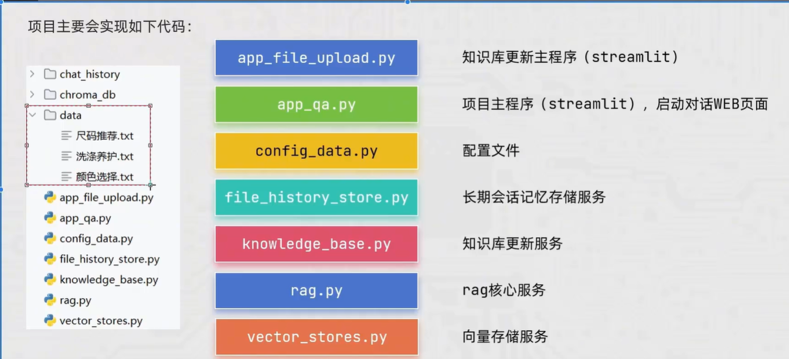
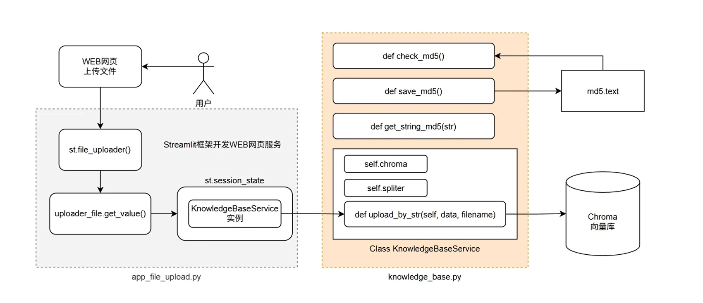
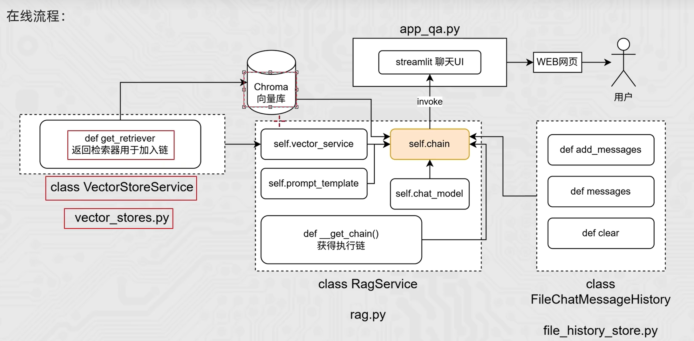

# 离线流程



# 在线流程



# LangChain RAG 智能客服项目演示

这是一个基于 LangChain 框架和 Streamlit 开发的 **RAG (Retrieval-Augmented Generation) 智能客服系统**。该项目演示了如何将大语言模型（LLM）与本地知识库结合，实现基于参考资料和历史对话上下文的问答系统。

## 🎯 功能特色

* **智能对话 UI**：基于 Streamlit 构建的简洁网页端聊天界面。
* **文件上传构建知识库**：提供了文件上传解析和向量化功能 (`app_file_uploader.py`, `knowledge_base.py`)，并且通过文件内容 MD5 去重，避免重复向量化。
* **RAG 检索增强**：用户提问时，系统会从向量数据库中召回相关资料来补充提示词（Prompt），提供准确度更高的回答。
* **上下文记忆**：融合了历史对话记录 (`file_history_store.py`)，确保多轮对话不会丢失上下文。
* **流式输出**：支持 LLM 的流式输出（Streaming），提供像 ChatGPT 一样的打字机逐步回复体验。

## 📂 核心文件说明

* `app.py`：智能客服聊天对话主界面的 Streamlit 应用。
* `app_file_uploader.py`：用于文件提取、切分与建立知识库的 Streamlit 应用后台。
* `rag.py`：RAG 核心执行类（`RagService`），封装了由 LangChain 构建的 执行链（Chain）、提示词（Prompt Template）和检索器（Retriever）。
* `knowledge_base.py`：文档处理与知识库管理模块，包括文本分块、MD5文件重复检测等逻辑。
* `vector_store.py`：构建或加载本地向量数据库实例（Chroma / Qdrant）。
* `file_history_store.py`：负责聊天记录记忆（Memory）功能的方法，将对话状态做序列化存储。
* `config_data.py`：统一存储项目的系统配置字段。

## 🚀 运行与启动方式

1. **依赖安装**:
   首先确保安装了依赖环境（如 `streamlit`, `langchain`, `langchain_community`, `dashscope` 阿里通义大模型支持 等）。

2. **环境变量配置**:
   请确保配置好阿里云通义大模型的 API-KEY `DASHSCOPE_API_KEY`。

3. **启动客户端界面**:
   打开命令行，在当前 `RagCase` 目录下运行：
   
   ```bash
   # 若要向知识库填充数据，启动上传界面 (假设有此页面入口)：
   streamlit run app_file_uploader.py
   
   # 启动聊天主界面
   streamlit run app.py
   ```

## 🛠️ 技术栈

* 大模型框架：[LangChain](https://github.com/langchain-ai/langchain)
* 前端 UI：[Streamlit](https://streamlit.io/)
* 大语言模型 / Embedding：DashScope (通义千问模型)
* 向量存储：Chroma / Qdrant
